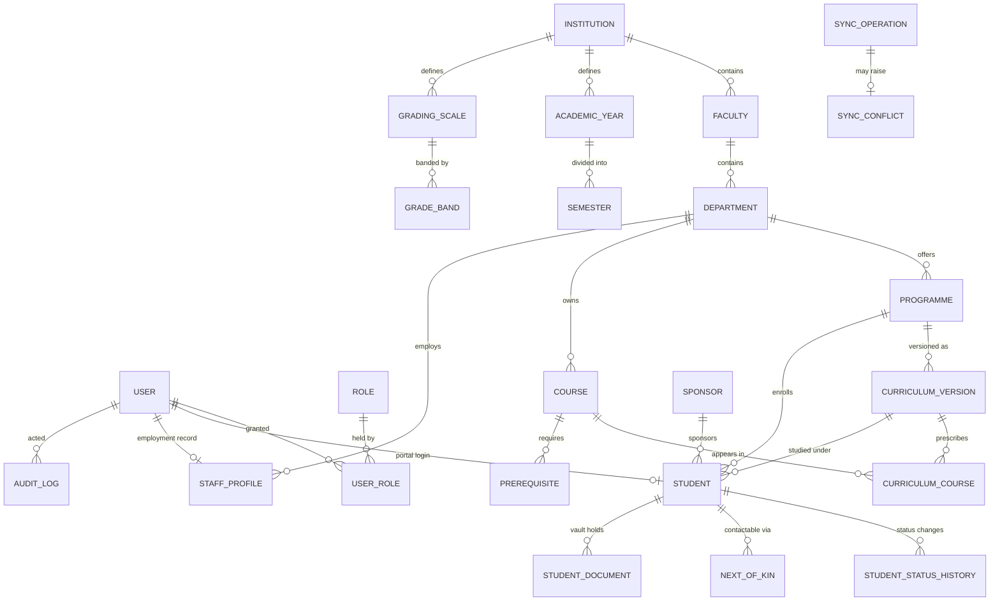

# UniACMIS — Phase 1 Data Model

Entities, relationships and invariants for the Phase 1 foundation: authentication and RBAC, the audit
trail, institutional configuration, the curriculum hierarchy, the core registry, and the sync engine.

Requirement IDs refer to `ACMIS_System_Requirements_Specification.docx` (see
[TRACEABILITY.md](TRACEABILITY.md)). Architectural rules referenced here are in
[ARCHITECTURE.md](ARCHITECTURE.md).

---

## 1. Overview



Design conventions applied to every table:

- **`BigAutoField` primary keys.** Sequential integers, not UUIDs, for index locality on modest campus
  hardware. Records that are exposed publicly or created offline carry a separate UUID (see §7).
- **`created_at` / `updated_at`** on all concrete models, from `core.TimeStampedModel`.
- **Soft delete where history matters** (`is_active` / `deleted_at` rather than row removal) for students,
  staff, courses and programmes. Academic history must remain reconstructable years later; a hard delete
  of a graduated student's programme would orphan their transcript.
- **Money is `(amount, currency)`** — no bare decimals anywhere. Phase 1 defines the field type; finance
  uses it from Phase 4.
- **Enumerations are `TextChoices`** with stable string values, so a report written against `"graduated"`
  keeps working when new statuses are added.

---

## 2. `accounts` — identity and RBAC

### `User`
Replaces Django's default user. Email is the credential, because staff and students in this context
reliably have one email but not a memorable username, and because password resets need an address.

| Field | Type | Notes |
|---|---|---|
| `email` | `EmailField` unique | Login identifier (`USERNAME_FIELD`) |
| `password` | hashed | Django PBKDF2/Argon2 (`NFR-SEC-04`) |
| `first_name`, `middle_name`, `last_name` | `CharField` | Middle name kept separate — South Sudanese naming commonly carries a distinct paternal name that must not be mangled into a single field for certificates |
| `phone` | `CharField` | E.164; the primary channel for critical notices (`NFR-USE-03`) |
| `is_active`, `is_staff`, `is_superuser` | `Boolean` | `is_staff` = Django-admin access only, not "is a staff member" |
| `mfa_enabled` | `Boolean` | Enforcement hook for finance/registrar roles (`NFR-SEC-04`) |
| `last_login_ip` | `GenericIPAddressField` | Access logging (`NFR-SEC-03`) |
| `must_change_password` | `Boolean` | Set on staff-created accounts; seeded demo accounts too |

### `Role`
| Field | Type | Notes |
|---|---|---|
| `code` | `CharField` unique | `registrar`, `lecturer`, `finance`, … (SRS §2.2) |
| `name`, `description` | `CharField`, `Text` | Shown in the admin |
| `group` | `OneToOne(auth.Group)` | Permissions live on the Django group; `Role` is the labelled façade |
| `is_system` | `Boolean` | System roles cannot be deleted, only edited |

### `UserRole`
A through-model rather than a plain M2M, because *who granted a role and when* is itself
security-relevant and must be auditable.

| Field | Type | Notes |
|---|---|---|
| `user`, `role` | FK | `unique_together` |
| `granted_by` | FK `User` `SET_NULL` | |
| `granted_at`, `revoked_at` | `DateTime` | Revocation is recorded, not deleted |

**Invariant.** Role grants and revocations always produce audit entries. A user's effective permissions
are the union of their active roles' group permissions; no permissions are assigned to users directly, so
there is exactly one place to read an authorisation decision from.

---

## 3. `audit` — tamper-evident trail

### `AuditLog`
Satisfies `FR-RPT-04` (tamper-evident, who/what/when), `NFR-SEC-03` (5-year retention) and SRS §6
(entity, field, old value, new value, user, timestamp).

| Field | Type | Notes |
|---|---|---|
| `content_type`, `object_id` | FK + `CharField` | Generic target; `object_id` is text so non-integer keys work |
| `object_repr` | `CharField` | Human label snapshotted at write time |
| `action` | choice | `create`, `update`, `delete`, `login`, `logout`, `view_sensitive`, `approve`, `sync_overwrite` |
| `field_name` | `CharField` | One row per changed field; null for non-field actions |
| `old_value`, `new_value` | `Text` null | Rendered as text; `null` distinguishes "was empty" from "not a field change" |
| `actor` | FK `User` `SET_NULL` | |
| `actor_name`, `actor_role` | `CharField` | Snapshotted, so the row survives user deletion or rename |
| `ip_address`, `user_agent` | | |
| `request_id` | `CharField` indexed | Correlates with the API error envelope (§10 of ARCHITECTURE) |
| `reason` | `Text` | Required for grade and money changes; the "why", which a diff cannot supply |
| `created_at` | `DateTime` indexed | Server receipt time, never a client clock |
| `prev_hash`, `row_hash` | `CharField(64)` | `sha256(prev_hash + canonical_payload)` chain |

**Invariants.**
- Append-only. No code path updates or deletes a row; in production the app's DB role lacks
  `UPDATE`/`DELETE` on this table.
- `row_hash` is computed server-side over a canonical serialisation. `verify_audit_chain` re-walks the
  chain and reports the first break, so retrospective editing is detectable rather than merely
  discouraged.
- For grade and financial writes the audit row is committed in the same transaction as the change.
  Elsewhere a logging failure is loudly reported but does not roll back the user's action.

Indexes: `(content_type, object_id, created_at)`, `(actor, created_at)`, `(created_at)`.

---

## 4. `academics` — institutional configuration

All of this is *data*, per `NFR-MAINT-03` — the university's registrar can change it without a deployment.

### `Institution`
Single row in Phase 1 (single campus, by decision).

| Field | Type | Notes |
|---|---|---|
| `name`, `short_name` | `CharField` | |
| `mohest_code` | `CharField` | Statutory reporting identifier (`FR-RPT-02`) |
| `default_currency` | `CharField(3)` | `SSP` (§2.5) |
| `secondary_currency` | `CharField(3)` null | `USD` for international fee categories |
| `logo`, `letterhead` | `ImageField`/`FileField` | Offer letters, transcripts, certificates |
| `student_id_template` | `CharField` | e.g. `{faculty}/{programme}/{year}/{seq:04d}` (`FR-REG-01`) |
| `attendance_threshold_percent` | `Decimal` | Default 75.00 (`FR-ATT-02`) — configurable, not a constant |
| `timezone` | `CharField` | `Africa/Juba` |

### `AcademicYear`
| Field | Type | Notes |
|---|---|---|
| `name` | `CharField` unique | `2026/2027` |
| `start_date`, `end_date` | `Date` | |
| `is_current` | `Boolean` | Exactly one true at a time, enforced in `clean()` + a partial unique index |

### `Semester`
Two per year by default (decision), but the count is data, so a trimester institution needs no code change.

| Field | Type | Notes |
|---|---|---|
| `academic_year` | FK `CASCADE` | |
| `sequence` | `PositiveSmallInteger` | 1, 2, …; `unique_together` with the year |
| `name` | `CharField` | `Semester 1` |
| `teaching_start`, `teaching_end` | `Date` | |
| `exam_start`, `exam_end` | `Date` | Drives exam windows (`FR-ENR-01`) |
| `registration_opens`, `registration_closes` | `DateTime` | Registration window (`FR-ENR-01`) |
| `add_drop_closes` | `DateTime` | `FR-ENR-01` add/drop period |
| `is_current` | `Boolean` | One current semester per institution |

### `GradingScale` / `GradeBand`
`FR-EXM-04` requires GPA computed to the institution's configured scale. Default seeded: 4.00.

`GradingScale`: `name`, `max_grade_point` (`Decimal`, 4.00), `is_default`, `pass_grade_point`,
`effective_from` (FK `AcademicYear`, null = always) — a scale change must not silently rewrite the GPAs of
prior cohorts.

`GradeBand`: `scale` FK, `letter` (`A`, `B+`, …), `min_percent`, `max_percent`, `grade_point`, `is_pass`,
`description` (`Distinction`, `Pass`, `Fail`).

**Invariants — validated in `GradingScale.clean()` and unit-tested:**
1. Bands cover 0–100 completely, with no gaps.
2. No two bands overlap.
3. Grade points do not exceed `max_grade_point`.
4. A scale referenced by any published result becomes immutable.

A grading scale with a 1-point gap or a silent overlap corrupts every transcript it touches and the error
is invisible until a student disputes a mark, so the validation is strict and the tests are not optional.

### GPA computation
Pure functions in `academics/services/grading.py`, no ORM, so they are trivially testable and reusable by
`examinations` in Phase 3:

```
grade_for(percent, scale)        -> GradeBand
gpa(entries)                     -> Decimal   # entries: [(credit_hours, grade_point)]
cgpa(semester_gpas)              -> Decimal   # credit-weighted across semesters
```

Credit-weighted: `Σ(credit_hours × grade_point) / Σ(credit_hours)`, quantised to 2 dp with explicit
`ROUND_HALF_UP`. Retakes and carry-overs affect which entries are included, not the arithmetic — that
policy is `examinations`' concern (`FR-ENR-05`).

---

## 5. `curriculum` — academic structure

`FR-CUR-01` Faculty → Department → Programme → Course.

### `Faculty`
`institution` FK, `name`, `code` (unique, used in student IDs), `dean` (FK `StaffProfile`, `SET_NULL`),
`is_active`.

### `Department`
`faculty` FK, `name`, `code` (unique), `head` (FK `StaffProfile`, `SET_NULL` — the HoD role's scope),
`is_active`.

### `Programme`
| Field | Type | Notes |
|---|---|---|
| `department` | FK | |
| `name`, `code` | `CharField` | Code used in student IDs |
| `award` | choice | `certificate`, `diploma`, `bachelor`, `postgraduate_diploma`, `masters`, `phd` |
| `duration_years` | `PositiveSmallInteger` | |
| `total_credits_required` | `PositiveSmallInteger` | Graduation requirement |
| `max_credits_per_semester` | `PositiveSmallInteger` | Registration ceiling (`FR-ENR-02`) |
| `min_credits_per_semester` | `PositiveSmallInteger` | |
| `entry_requirements` | `JSONField` | Configurable rules screened against in Phase 2 (`FR-ADM-03`) |
| `is_active` | `Boolean` | |

### `CurriculumVersion` — `FR-CUR-03`
`programme` FK, `version` (`CharField`, e.g. `2026-v1`), `effective_from` (FK `AcademicYear`),
`effective_to` (FK, null = current), `status` (`draft`/`active`/`retired`), `approved_by`, `approved_at`.

A student is bound to the version they entered under. Without this, editing a programme's course list in
2029 retroactively changes what the 2026 cohort was required to pass — which makes their transcripts
indefensible. `unique_together (programme, version)`.

### `Course`
`department` FK (owner), `code` (unique), `title`, `credit_hours`, `level` (year of study 1–6),
`description`, `is_active`. Courses are owned by a department and *referenced* by curricula, so a service
course taught to several programmes exists once.

### `CurriculumCourse`
Join between a curriculum version and a course, carrying where the course sits in the programme:
`curriculum_version` FK, `course` FK, `year_of_study`, `semester_sequence`, `is_core` (core vs elective,
`FR-CUR-02`), `elective_group` (`CharField` null — "choose 2 of 4"). `unique_together
(curriculum_version, course)`.

### `Prerequisite`
`course` FK, `required_course` FK, `minimum_grade_point` (`Decimal` null), `is_concurrent_allowed`
(`Boolean`). Validated at registration in Phase 2 (`FR-ENR-02`). `clean()` rejects self-reference; a
cycle check runs on save, because a prerequisite loop makes a programme impossible to complete and is
easy to create by hand.

---

## 6. `registry` — students and staff

### `Student`
| Field | Type | Notes |
|---|---|---|
| `student_id` | `CharField` unique | Non-reusable (`FR-REG-01`); generated per template (§8) |
| `user` | `OneToOne` null `SET_NULL` | Null until the portal account is activated — records exist before logins do |
| `programme` | FK `PROTECT` | |
| `curriculum_version` | FK `PROTECT` | The syllabus they are bound to (`FR-CUR-03`) |
| `entry_academic_year` | FK | Cohort |
| `current_level` | `PositiveSmallInteger` | Year of study |
| `status` | choice | `active`, `suspended`, `deferred`, `withdrawn`, `graduated`, `expelled` (`FR-REG-04`) |
| `sponsorship_type` | choice | `self`, `government`, `scholarship`, `bursary`, `employer`, `ngo` — distinct accounts per `FR-FIN-04` |
| `sponsor` | FK `Sponsor` null | |
| `first_name`, `middle_name`, `last_name` | `CharField` | Mirrored from `user` where linked; authoritative here, since a student record may precede any account |
| `date_of_birth` | `Date` | |
| `gender` | choice | Disaggregated reporting (`FR-RPT-03`) |
| `national_id_number`, `passport_number` | `CharField` null | |
| `nationality` | `CharField` | |
| `state_of_origin` | choice null | South Sudan's 10 states + 3 administrative areas (`FR-RPT-03`) |
| `county` | `CharField` null | |
| `has_disability`, `disability_details` | `Boolean`, `Text` | `FR-REG-02`, `FR-RPT-03`; special-needs support and quota rules |
| `phone`, `alternate_phone`, `email` | | SMS is the reliable channel |
| `physical_address` | `Text` | |
| `photo` | `ImageField` | ID cards, exam verification |
| `previous_institution`, `previous_qualification` | `CharField` null | Academic history (`FR-REG-05`) |
| `transfer_credits` | `PositiveSmallInteger` | Credit transfer recording (`FR-REG-05`) |
| `admitted_on`, `graduated_on` | `Date` null | |
| `is_active` | `Boolean` | Soft delete |

Indexes: `student_id` (unique), `(programme, status)`, `(entry_academic_year, status)`, `(last_name, first_name)`, `national_id_number`.

`state_of_origin` choices: Central Equatoria, Eastern Equatoria, Western Equatoria, Jonglei, Unity, Upper
Nile, Warrap, Northern Bahr el Ghazal, Western Bahr el Ghazal, Lakes, plus the Abyei, Greater Pibor and
Ruweng administrative areas. Held as a `TextChoices` rather than free text specifically because
`FR-RPT-03` requires statutory reporting disaggregated by state of origin, and free text makes that
aggregation guesswork.

### `StudentStatusHistory` — `FR-REG-04`
`student` FK, `from_status`, `to_status`, `reason` (`Text`, required), `effective_date`, `changed_by` FK
`SET_NULL`, `created_at`. Append-only. Duplicates some of what the audit log holds, deliberately: status
history is a *domain* record the registrar reads and reports on, not a forensic log, and it must survive
audit-log archival.

### `NextOfKin`
`student` FK, `full_name`, `relationship`, `phone`, `alternate_phone`, `email`, `address`, `is_primary`.
Multiple rows allowed (`FR-REG-02`); exactly one primary, enforced in `clean()`.

### `Sponsor`
`name`, `sponsor_type` (`government`, `ngo`, `company`, `individual`, `scholarship_fund`),
`contact_person`, `phone`, `email`, `address`, `is_active`. Referenced by finance in Phase 4 for sponsored
billing (`FR-FIN-04`).

### `StudentDocument` — `FR-REG-03`
`student` FK, `document_type` (`certificate`, `transcript`, `national_id`, `passport`, `photo`,
`medical_clearance`, `recommendation`, `other`), `title`, `file` (`FileField`), `file_size`,
`content_hash` (`CharField(64)` — detects substitution of a verified document), `uploaded_by`,
`verified_by` FK null, `verified_at`, `notes`. Uploads are size-capped, per the checklist's low-bandwidth
requirement.

### `StaffProfile`
`user` `OneToOne` `CASCADE`, `staff_number` unique, `department` FK `SET_NULL`, `appointment_type`
(`full_time`, `part_time`, `contract`, `visiting`, `adjunct`), `staff_category` (`academic`,
`administrative`, `support`), `rank` (`professor`, `associate_professor`, `senior_lecturer`, `lecturer`,
`assistant_lecturer`, `teaching_assistant`, `not_applicable`), `highest_qualification`, `date_of_hire`,
`contract_end_date`, `phone`, `date_of_birth`, `gender`, `national_id_number`, `is_active`.

Phase 1 holds the core record only. Contracts, qualifications, leave and appraisal belong to `hr` in
Phase 5 (`FR-HR-01`…`FR-HR-04`); `StaffProfile` is the identity those attach to, and is needed now because
`Department.head`, `Faculty.dean` and course allocation all point at it.

---

## 7. `core` — sync engine and shared infrastructure

### `SyncOperation`
The idempotency ledger that makes offline replay safe (`NFR-AVAIL-01`).

| Field | Type | Notes |
|---|---|---|
| `client_op_id` | `UUIDField` unique | Client-generated; the deduplication key |
| `entity` | `CharField` | `registry.student`, later `attendance.session_record` |
| `action` | choice | `create`, `update`, `delete` |
| `payload` | `JSONField` | As submitted, retained for dispute resolution |
| `client_timestamp` | `DateTime` | Client clock — recorded, but not trusted for audit ordering |
| `received_at` | `DateTime` | Server clock; the authoritative time |
| `status` | choice | `applied`, `duplicate`, `conflict`, `rejected` |
| `result` | `JSONField` null | Stored so a replay returns the original outcome instead of re-applying |
| `error_detail` | `Text` null | |
| `submitted_by` | FK `User` `SET_NULL` | |
| `device_id` | `CharField` | Which machine queued it — useful when one laptop's clock is wrong |
| `target_content_type`, `target_object_id` | | What it actually created or changed |

Indexes: `client_op_id` (unique), `(entity, status)`, `(submitted_by, received_at)`.

### `SyncConflict`
Raised, never auto-resolved, by `FLAG_FOR_REVIEW` entities (grades, money).

`sync_operation` FK, `entity`, `target_content_type`/`target_object_id`, `field_name`,
`server_value`/`client_value` (`Text`), `server_updated_at`, `client_timestamp`, `status`
(`open`/`resolved_server`/`resolved_client`/`dismissed`), `resolved_by`, `resolved_at`,
`resolution_reason` (`Text`, required to close).

### `IdSequence`
Gapless, race-free counters for human-facing identifiers (student IDs now; receipt and invoice numbers in
Phase 4).

`scope` (`CharField` unique, e.g. `student_id:ENG:2026`), `last_value` (`PositiveInteger`),
`updated_at`. Allocation takes a row lock (`select_for_update()`) inside the caller's transaction. Two
registry clerks admitting students simultaneously must not be able to mint the same number, and a
`max(id)+1` query cannot promise that.

---

## 8. Student ID generation — `FR-REG-01`

Format comes from `Institution.student_id_template`; the default aligns to faculty and year as the
workflow checklist requires:

```
{faculty}/{programme}/{year}/{seq:04d}      →  ENG/CIV/2026/0042
```

- `seq` is allocated from `IdSequence` under `select_for_update()`, scoped per
  faculty + programme + entry year.
- Uniqueness is additionally guaranteed by the `unique=True` constraint on `Student.student_id` — the
  application logic and the database both enforce it, because this identifier appears on certificates.
- **Non-reusable**: sequence counters never decrease, and a withdrawn or expelled student's ID is never
  reissued. Soft delete rather than row deletion is what makes that hold.
- Tested under concurrency (parallel transactions competing for the same scope).

---

## 9. What Phase 1 deliberately does not model

Applications and admissions decisions (Phase 2) · course registration and class lists (Phase 2) ·
timetables (Phase 3) · attendance records (Phase 3) · marks, moderation and Senate approval (Phase 3) ·
fee structures, invoices, payments and scholarship ledgers (Phase 4) · leave, appraisal, library, hostel
(Phase 5) · transcripts, certificates and verification serials (Phase 6) · `Campus` and campus↔central
replication (deferred by decision — see [TRACEABILITY.md](TRACEABILITY.md)).

Phase 1's job is that each of those can be added without reshaping anything above.
